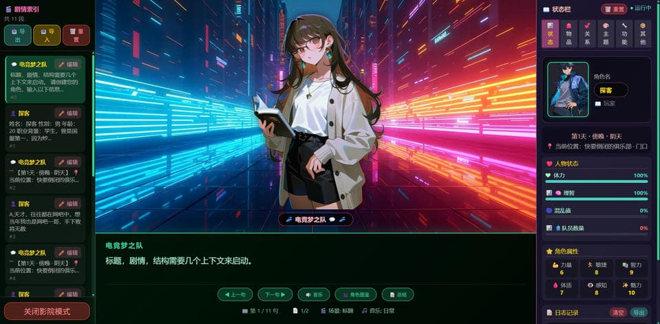
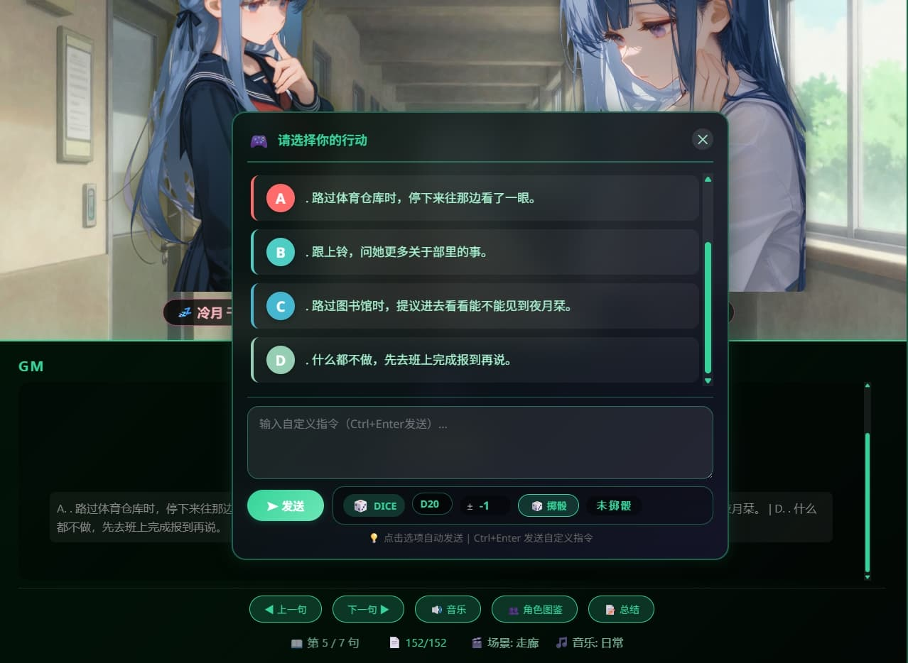

# 🎬 ST-Cinema Mode

将SillyTavern的聊天过程转换为沉浸式Galgame风格的影院播放器。

[](https://github.com/yourusername/ST-CinemaMode)
[](LICENSE)
[](https://github.com/SillyTavern/SillyTavern)

---

## 📸 Preview / 预览

### Main Interface / 主界面



*沉浸式全屏影院播放器，包含角色立绘、场景背景和动态文本显示。*
*The immersive full-screen cinema player with character portraits, scene backgrounds, and dynamic text display.*

---

## 📖 Table of Contents / 目录

- [English Introduction](#english-introduction)
- [中文介绍](#中文介绍)
- [User Interface Guide](#-user-interface-guide--界面使用指南)
- [Installation](#-installation--安装方法)
- [AI Response Format](#-ai-response-format--ai回复格式)
- [Usage Guide](#-usage-guide--使用指南)
- [Theme Previews](#-theme-previews--主题预览)
- [File Structure](#-file-structure--文件结构)
- [Requirements](#-requirements--系统要求)
- [License](#-license--开源协议)

---

## English Introduction

### Overview

**ST-Cinema Mode** is a powerful SillyTavern extension that transforms your AI chat experience into an immersive visual novel / Galgame-style cinema player. It automatically parses AI responses and presents them with a beautiful cinematic UI, complete with character portraits, background scenes, background music, status tracking, and interactive options.

### Key Features

- 🎬 **Cinematic UI** - Immersive full-screen player with dynamic backgrounds and character portraits
- 👥 **Smart Character Detection** - Automatically identifies and displays characters appearing in the conversation
- 🎵 **Dynamic Music System** - Background music that changes based on scene mood and story context
- 📊 **Real-time Status Synchronization** - Parses status bars from AI responses and displays them as RPG-style attributes and progress bars
- 🎮 **Interactive Options** - Supports choice selection panels (A/B/C/D options) for interactive storytelling
- 🎲 **Built-in Dice System** - D4 to D100 dice roller with modifier support for tabletop RPG experiences
- 🎨 **25+ Color Themes** - Customizable visual themes including Cyberpunk, Aurora, Sakura, Galaxy, and more
- 📝 **Context Compression** - Smart summarization tool to manage long conversations
- ✏️ **Message Editor** - Edit any message with real-time UI updates
- 💾 **Save/Load System** - Export and import game progress, including all character relationships and status

---

## 中文介绍

### 概述

**ST-Cinema Mode** 是一个强大的SillyTavern扩展插件，将您的AI聊天体验转变为沉浸式的视觉小说/Galgame风格影院播放器。它能自动解析AI回复，并以精美的影院界面呈现，包含角色立绘、场景背景、背景音乐、状态追踪和交互选项。

### 核心功能

- 🎬 **影院级界面** - 沉浸式全屏播放器，搭配动态背景和角色立绘
- 👥 **智能角色识别** - 自动识别并显示对话中出现的角色
- 🎵 **动态音乐系统** - 根据场景氛围和剧情上下文自动切换背景音乐
- 📊 **实时状态同步** - 从AI回复中解析状态栏，以RPG风格属性和进度条展示
- 🎮 **交互式选项** - 支持选项面板（A/B/C/D选项），实现互动叙事
- 🎲 **内置骰子系统** - D4至D100骰子，支持修正值，适合跑团体验
- 🎨 **25+色彩主题** - 可定制视觉主题，包括赛博朋克、极光、樱花、银河等
- 📝 **上下文压缩** - 智能总结工具，帮助管理长对话
- ✏️ **消息编辑器** - 编辑任意消息，实时更新UI
- 💾 **存档系统** - 导出和导入游戏进度，包括所有角色关系和状态

---

## 📖 User Interface Guide / 界面使用指南

### 1. Cinema Player Interface / 影院播放器界面


| 标注 | 说明 (中文) | Description (English) |
|------|------------|----------------------|
| **A** | 角色立绘 - 显示当前场景中的角色 | Character portraits - Shows characters currently in the scene |
| **B** | 说话人 - 当前说话的角色名 | Speaker name - Who is currently speaking |
| **C** | 文本内容 - 带格式的剧情文本 | Text content - The story text with formatting |
| **D** | 控制按钮 - 导航、自动播放、音乐开关 | Control buttons - Navigation, auto-play, music toggle |
| **E** | 进度指示 - 当前在故事中的位置 | Progress indicator - Current position in the story |
| **F** | 状态面板 - 显示游戏状态、物品、关系 | Status panel - Shows game stats, inventory, relationships |

### 2. Character Portraits / 角色立绘


扩展自动从对话中识别角色并以立绘显示。每个角色显示：

- 立绘图片（来自 `images/portrait/` 文件夹）
- 带情绪图标的角色名
- 心情状态（开心、悲伤、惊讶等）

*The extension automatically detects characters from the conversation and displays them as portraits. Each character shows:*
- *Portrait image (from the `images/portrait/` folder)*
- *Character name with emotion icon*
- *Mood status (happy, sad, surprised, etc.)*

### 3. Status Panel / 状态面板


右侧状态面板实时显示游戏状态：

| 栏目 (中文) | 说明 (中文) | Section (English) | Description (English) |
|------------|------------|-------------------|----------------------|
| **游戏信息** | 天数、时段、天气、地点 | **Game Info** | Day, time, weather, location |
| **人物状态** | 体力、理智、饥饿等（进度条） | **Character Status** | Health, sanity, hunger, etc. (progress bars) |
| **角色属性** | 力量、敏捷、智力等 | **Attributes** | Strength, agility, intelligence, etc. |
| **物品栏** | 带图标和数量的物品 | **Inventory** | Items with icons and quantities |
| **人际关系** | 角色好感度与心情指示 | **Relationships** | Character affection levels with mood indicators |
| **其他栏目** | AI回复中的自定义栏目 | **Other Sections** | Custom sections from AI responses |

### 4. Options Panel / 选项面板



当AI提供选项时，会显示交互式选项面板：

| 功能 (中文) | 说明 (中文) | Feature (English) | Description (English) |
|------------|------------|-------------------|----------------------|
| **选项按钮** | 点击 A、B、C、D 选择 | **Option Buttons** | Click A, B, C, D to choose |
| **自定义输入** | 输入自定义指令（Ctrl+Enter发送） | **Custom Input** | Type your own command (Ctrl+Enter to send) |
| **骰子投掷** | 掷D4-D100骰子，带修正值 | **Dice Roller** | Roll D4-D100 with modifiers |
| **选项描述** | 情境的上下文描述 | **Option Description** | Contextual description of the situation |

### 5. Theme Selector / 主题选择器


在"主题"标签页中切换25+种视觉主题：

| 主题 (中文) | 说明 (中文) | Theme (English) | Description (English) |
|------------|------------|-----------------|----------------------|
| 默认 | 经典影院风格 | Default | Classic cinema style |
| 赛博朋克 | 霓虹都市，未来感 | Cyberpunk | Neon city, futuristic |
| 极光 | 极光流转，梦幻色彩 | Aurora | Flowing aurora colors |
| 樱花 | 樱花纷飞，浪漫唯美 | Sakura | Cherry blossom, romantic |
| 银河 | 浩瀚星河，璀璨壮丽 | Galaxy | Starry galaxy, magnificent |
| ...及其他20+种 | 各种风格，满足不同心情 | ...and 20+ more | Various styles for every mood |

### 6. Auto-Play Mode / 自动播放模式


自动播放功能以舒适的节奏阅读故事：

| 速度 (中文) | 字/分钟 | 适合场景 | Speed (English) | Words/Min | Best For |
|------------|---------|---------|-----------------|-----------|----------|
| 🐢 慢速 | 180 | 仔细阅读 | 🐢 Slow | 180 | Detailed reading |
| 🎮 Galgame | 240 | 视觉小说风格 | 🎮 Galgame | 240 | Visual novel style |
| ⚡ 正常 | 300 | 正常阅读 | ⚡ Normal | 300 | Standard reading |
| 🚀 快速 | 450 | 快速浏览 | 🚀 Fast | 450 | Quick browsing |

---

## 🚀 Installation / 安装方法

### English

1. Download or clone this repository
2. Copy the `ST-CinemaMode` folder to your SillyTavern `extensions` directory
3. Restart SillyTavern or click the "Extensions" button to reload
4. Click the 🎬 **Cinema Mode** button in the bottom-right corner

### 中文

1. 下载或克隆此仓库
2. 将 `ST-CinemaMode` 文件夹复制到 SillyTavern 的 `extensions` 目录
3. 重启 SillyTavern 或点击"扩展"按钮重新加载
4. 点击右下角的 🎬 **影院模式** 按钮

---

## 📝 AI Response Format / AI回复格式

扩展识别以下特殊格式：

*The extension recognizes these special formats:*

```markdown
```markdown
【第1天 · 傍晚 · 阴天】
📍 当前位置：大学宿舍楼

【人物状态】
❤️ 体力：85/100
🧠 理智：92/100

【人际关系】
【张磊|男|显|开心|好感度:75/100】- 室友，正在打游戏
【李娜|女|显|微笑|好感度:30/100】- 隔壁班同学

【物品栏】
手机：1（电量67%）
钥匙：1
```
```


### Status Bar Format / 状态栏格式

| 元素 (中文) | 格式 (中文) | 示例 (中文) | Element (English) | Format (English) | Example (English) |
|------------|------------|------------|-------------------|------------------|-------------------|
| 角色状态 | `【角色\|性别\|显隐\|心情\|好感度:数值/100】-描述` | `【张磊\|男\|显\|开心\|好感度:75/100】-室友` | Character Status | `[Name\|Gender\|Visible\|Mood\|Affection:value/100]-description` | `[Zhang Lei\|Male\|Visible\|Happy\|Affection:75/100]-Roommate` |
| 属性 | `名称：数值/最大值` | `体力：85/100` | Attributes | `Name: value/max` | `Health: 85/100` |
| 物品 | `名称：数量` | `手机：1` | Items | `Name: quantity` | `Phone: 1` |
| 游戏信息 | `第X天 · 时段 · 天气` | `第1天 · 傍晚 · 阴天` | Game Info | `Day X · Time · Weather` | `Day 1 · Evening · Cloudy` |
| 位置 | `📍 当前位置：地点` | `📍 当前位置：大学宿舍楼` | Location | `📍 Current Location: place` | `📍 Current Location: Dormitory` |

### Options Format / 选项格式


```
[[[
请选择你的行动：
[A]. 和张磊一起打游戏
[B]. 去找李娜聊天
[C]. 出门散步
]]]
```

```
[[[
请选择：
A. 选项一
B. 选项二
C. 选项三
]]]
```

也可以使用简单格式：

```
A. 选项一
B. 选项二
C. 选项三
```

---

## 🎮 Usage Guide / 使用指南

### Quick Start / 快速开始

| 步骤 (中文) | 操作 (中文) | Step (English) | Action (English) |
|------------|------------|----------------|------------------|
| 1. **启动** | 点击右下角的 🎬 按钮 | 1. **Launch** | Click the 🎬 button in the bottom-right corner |
| 2. **导航** | 点击文字区域前进，或使用控制按钮 | 2. **Navigate** | Click the text area to advance, or use the control buttons |
| 3. **自动播放** | 点击播放按钮自动阅读 | 3. **Auto-play** | Click the play button for automatic reading |
| 4. **选择选项** | 在选项面板中点击选择 | 4. **Choose Options** | Click your choice in the options panel |
| 5. **自定义指令** | 在输入框中输入（Ctrl+Enter发送） | 5. **Custom Commands** | Type in the input box (Ctrl+Enter to send) |
| 6. **掷骰子** | 使用内置骰子进行跑团判定 | 6. **Roll Dice** | Use the built-in dice roller for RPG actions |

---

## 🎨 Theme Previews / 主题预览

部分可用主题预览：

*Here are some of the available themes:*

| 主题 (中文) | 预览 (中文) | Theme (English) | Preview (English) |
|------------|------------|-----------------|-------------------|
| 默认 | 🎬 | Default | 🎬 |
| 赛博朋克 | 🌃 | Cyberpunk | 🌃 |
| 极光 | 🌠 | Aurora | 🌠 |
| 樱花 | 🌸 | Sakura | 🌸 |
| 银河 | 🌌 | Galaxy | 🌌 |
| 日落 | 🌅 | Sunset | 🌅 |
| 海洋 | 🌊 | Ocean | 🌊 |
| 森林 | 🌲 | Forest | 🌲 |
| 午夜 | 🌙 | Midnight | 🌙 |

*更多主题请在"主题"标签页查看！*
*More themes available in the Theme tab!*

---

## 📁 File Structure / 文件结构

```
ST-CinemaMode/
├── index.js                 # 主要扩展代码 / Main extension code
├── manifest.json            # 扩展清单 / Extension manifest
├── README.md               # 文档 / Documentation
├── example/                # 示例图片 / Example images
│   ├── demo-preview.jpg    # 主预览 / Main preview
│   ├── ui-interface.jpg    # 界面指南 / UI guide
│   ├── character-portrait.jpg # 角色示例 / Character example
│   ├── status-panel.jpg    # 状态面板 / Status panel
│   ├── options-panel.jpg   # 选项面板 / Options panel
│   └── theme-selector.jpg  # 主题选择器 / Theme selector
├── images/
│   ├── background/         # 场景背景 / Scene backgrounds
│   ├── portrait/           # 角色立绘 / Character portraits
│   │   ├── library/        # 立绘库 / Portrait library
│   │   │   ├── 女/         # 女性立绘 / Female portraits
│   │   │   ├── 男/         # 男性立绘 / Male portraits
│   │   │   └── 通用/       # 通用立绘 / Universal portraits
│   │   └── player/         # 玩家立绘 / Player portraits
│   └── music/              # 背景音乐 / Background music
└── style.css              # 样式表（可选）/ Stylesheet (optional)
```

---

## 🛠️ Requirements / 系统要求

| 要求 (中文) | 说明 (中文) | Requirement (English) | Description (English) |
|------------|------------|----------------------|----------------------|
| **SillyTavern** | 1.11.0 或更高版本 | **SillyTavern** | 1.11.0 or higher |
| **浏览器** | 支持ES6的现代浏览器 | **Browser** | Modern browser with ES6 support |
| **存储空间** | 约50MB用于图片和音乐 | **Storage** | ~50MB for images and music |

---

## 🤝 Contributing / 贡献

欢迎贡献！请随时提交Pull Request。

*Contributions are welcome! Please feel free to submit a Pull Request.*

### Development / 开发

1. Fork the repository
2. Create your feature branch
3. Make your changes
4. Submit a Pull Request

---

## 📄 License / 开源协议

MIT License - 免费使用、修改和分发。

*MIT License - Free to use, modify, and distribute.*

---

## 🙏 Credits / 致谢

- **作者 / Author**: 技术探客
- 为SillyTavern社区构建 / Built for the SillyTavern community
- 感谢所有贡献者和用户 / Thanks to all contributors and users

---

## 📞 Support / 支持

- **Issues**: [GitHub Issues](https://github.com/Tech-Explorer-AI/ST-CinemaMode/issues)

---

## ⭐ Star History

如果您喜欢这个项目，请在GitHub上给它一个星标 ⭐！

*If you like this project, please give it a star ⭐ on GitHub!*

---

*Made with ❤️ for the SillyTavern community*
```
